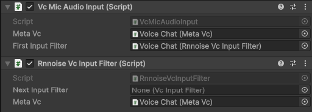

## Supported Networking Solutions
- [Mirror](https://github.com/MirrorNetworking/Mirror)
- [Netcode for GameObjects](https://docs-multiplayer.unity3d.com/netcode/current/about/)
- [FishNet](https://github.com/FirstGearGames/FishNet)
- [Netick](https://github.com/NetickNetworking/NetickForUnity)

Other Unity networking solutions can easily be implemented by composing an agnostic MonoBehaviour and implementing a minimal interface — please feel free to contribute additional network provider implementations. Please make PRs with any of your changes or improvements if you feel they would be helpful to the public. Please create issues for things as you see fit.

## Table of Contents
- [Installation](#installation)
- [Notice for Unity Versions 2021 and Older!!!](#notice-for-unity-versions-2021-and-older)
- [Information](#information)
- [Video Tutorial](#video-tutorial)
- [Tutorial](#tutorial)
- [Tips](#tips)
- [Thank Yous](#thank-yous)
- [Network Providers](#network-providers)
- [Missing Things](#missing-things)
    - [Network Providers](#missing-network-providers)
    - [Features](#missing-features)
- [Extending Functionality](#extending-functionality)
    - [Network Provider](#how-do-i-write-a-network-provider-implementation)
    - [VcAudioInput](#how-do-i-write-a-vcaudioinput)
    - [VcAudioOutput](#how-do-i-write-a-vcaudiooutput)
    - [VcInputFilter](#how-do-i-write-a-vcinputfilter)
    - [VcOutputFilter](#how-do-i-write-a-vcoutputfilter)
- [Things Using MetaVoiceChat](#things-using-metavoicechat)
- [License](#license)
- [Contact and Support](#contact-and-support)
- [Examples](Examples/)
- [Changelog](CHANGELOG.md)

## <i><b>Installation</b></i>
1. Go to "Releases" and download and install the latest Unity package.
2. See [Tutorial](#tutorial) for additional steps.

## <b>Notice for Unity versions 2021 and older!!!</b>
- For older versions of Unity that do not include the System.Memory namespace, you must use [the legacy branch of MetaVoiceChat](https://github.com/Metater/MetaVoiceChat/tree/legacy).
- Unity made this change somewhere in the 2021 versions of Unity.
- If you are using 2021, try the main branch first, but if you get errors, use the legacy branch.
- If you are using 2020 or earlier, use the legacy branch.

## Information
- Simple
    - Default Unity microphone
    - No user code required for basic usage and completely self-contained
    - No complicated cloud services required -- everything just works with your existing networking library
- Configurable
    - Exposed Opus settings (defaults in bold)
        - Application: <b>VOIP</b>, Audio, or Restricted Low-Delay
        - Complexity: 0-<b>10</b> (0 is less complex, while <b>10</b> is more complex)
        - Frame size: 10 ms, <b>20 ms</b>, or 40 ms
        - Signal: <b>Voice</b>, Music, or Auto
    - General settings
        - Jitter calculation time window size in seconds
        - Jitter mean time offset calculation window size in updates
        - Output min buffer size in fractional frames
    - Audio pipeline system
        - VcAudioInput settings
            - First input filter (nullable)
        - VcInputFilter settings
            - Next input filter (nullable)
        - VcAudioOutput settings
            - First output filter (nullable)
        - VcOutputFilter settings
            - Next output filter (nullable)
    - VcAudioSourceOutput settings
        - Audio source
        - Buffer frame lifetime in seconds
        - Buffer max negative latency in seconds
        - Pitch proportional gain in percent per second of latency error
        - Pitch max correction in percent
    - Default input is the Unity microphone
    - Default output is a Unity Audio Source
- Functional
    - Optional realtime noise suppression using [Vatsal Ambastha's RNNoise4Unity](https://github.com/adrenak/RNNoise4Unity) (see [tutorial](#tutorial) for usage)
    - Automatic microphone reconnection configurable with VcMicAudioInput.SetSelectedDevice(string device)
    - VcMicAudioInput OnActiveDeviceChanged event
    - Functionality and reactive properties with events for
        - Speaking
        - Deafening yourself
        - Input muting yourself
        - Output muting others
    - Unity microphone wrapper
    - Circular audio clip
    - RMS jitter calculation utility within a time window and mean time offset window using a mean deviation method
    - Thread-safe fixed length array pool utility
    - Serializable reactive property utility
    - Frame stopwatch utility
    - Microphone devices listener utility
- Modular
    - Abstract VcAudioInput and VcAudioOutput classes
    - Abstract VcInputFilter and VcOutputFilter pipelines
- Testable
    - Echo mode to playback your own voice
    - Sine wave voice override mode
    - Max codec milliseconds before warning
        - These warnings are limited to once per frame by default
- Details
    - No memory garbage created at runtime using pooled data buffers
    - Constants
        - 48kHz sampling frequency
        - Wideband Opus bandwidth
        - SILK Opus mode
        - Single audio channel
        - 16-bit audio
        - 1 second input and output audio clip loop time
    - Average latency is ~200 ms with default settings
    - Dynamic buffer latency compensation using a latency error P-controller with RMS jitter, sender FPS, server/host FPS, and receiver FPS adjustments
- Opus features
    - Variable bitrate encoding
    - [Opus Official Website](https://opus-codec.org/)

## Video Tutorial
https://youtu.be/2fSqSAnRS5M

## Tutorial
1. Ensure you have properly completed the [installation](#installation) steps.
2. Create a "Voice Chat" or similarly named game object as a child of your networked player game object or other networked game object that you would like to have networked audio on.
3. Add the "MetaVc" component to the "Voice Chat" game object.
4. Add your desired audio input, such as "VcMicAudioInput" to the game object.
5. Likewise, add your desired audio output, such as "VcAudioSourceOutput" to the game object.
6. Connect your audio input and output to the "MetaVc" fields.
7. Lastly, add your desired network provider, such as <b>"MirrorNetProvider"</b>, <b>"NgoNetProvider"</b>, <b>"FishNetNetProvider"</b>, or <b>"NetickNetProvider"</b> to the game object.
8. It should look something like this now: 
    - All of these defaults should be okay, however you may want to decrease the "Complexity" field for games with many concurrently connected users or lower-end devices.
    - Remember to use "Max Codec Milliseconds" to ensure that your complexity value is not too high for your game.
        - Note: The codec performs sluggishly in bursts, so set this value higher than your desired frame period and ensure warnings are not being spammed and then increase it back to the max to disable it when you are done testing.
    - Use "Allow Multiple Codec Warnings Per Frame" to ensure you get the total frame time used by the codec when there are warnings.
9. Create a "Voice Chat Output" or similarly named Audio Source game object as a child of the networked game object. If this is a player, it should be in the mouth area.
10. Configure the output Audio Source
    - "Output" = the voice chat audio mixer group (optional)
    - "Play On Awake" is set to false internally, so don't worry
    - "Loop" is set to true internally, so don't worry
    - "Spacial Blend" = 1 for 3D proximity chat and 0 for normal voice chat
    - "3D Sound Settings"
        - "Doppler Level" is set to 0 internally, so don't worry (It must be 0 because of how Unity implements this)
        - "Max Distance" = ~50 meters or whatever you think is best
        - Ensure the volume roll-off curve's last data point has a volume of zero.
    - Your general settings should look like this: 
    - Your 3D sound settings should look like this: 
11. Connect your voice chat output Audio Source to the "Audio Source" field under the "Vc Audio Source Output" component.
12. Connect the "Meta Vc" fields under your audio input and output to the "Meta Vc" sibling component.
13. At this point, the "Voice Chat" game object should look like this: 
14. <b>You are done!!! See [Examples](Examples/) for advanced usage.</b>
15. <b>Optionally</b>, you can install [Vatsal Ambastha's RNNoise4Unity](https://github.com/adrenak/RNNoise4Unity) to use the noise suppression [RnnoiseVcInputFilter](rnnoise/RnnoiseVcInputFilter.cs).
16. Be sure to follow the scoped registry setup instructions for [RNNoise4Unity](https://github.com/adrenak/RNNoise4Unity).
17. Uncomment the <i>#define ENABLE_RNNOISE_FOR_META_VOICE_CHAT</i> in [RnnoiseVcInputFilter](rnnoise/RnnoiseVcInputFilter.cs).
18. Set up [RnnoiseVcInputFilter](rnnoise/RnnoiseVcInputFilter.cs) like this: 
19. Now you are even more done! See [tips](#tips) below.

## Tips
- Change Project Settings/Audio/DSP Buffer Size from "Best performance" to "Best latency"
- Apply input and output filters to audio inputs and outputs by using the first filter fields
- Chain together input and output filters to form pipelines by using the next filter fields
- Disable and enable input and output filters by doing <b><i>filterComponent.enabled = false/true</i></b> or use the inspector tick box
- A frame size of 10 ms is useful for achieving lower latency on higher-end devices with high network send rates for all users. A frame size of 40 ms is useful for optimization on lower-end devices and networks, but this negatively impacts ear-to-ear latency and worsens the audio quality when packets are dropped. A frame size of 20 ms is a good balance.

## Thank Yous

### A massive thank you to [Vatsal Ambastha](https://github.com/adrenak) and his projects [UniVoice](https://github.com/adrenak/univoice) and [UniMic](https://github.com/adrenak/unimic) that were heavily referenced when starting this project in late 2023. His [RNNoise4Unity](https://github.com/adrenak/RNNoise4Unity) project enables optional realtime noise suppression (separate package, see tutorial for usage).

### Another thank you to [Concentus: Opus for Everyone](https://github.com/lostromb/concentus) for their native C# implementation of Opus that makes it extremely easy to add Opus to projects like this.

## Network Providers
- [Mirror](https://github.com/MirrorNetworking/Mirror)
- [Netcode for GameObjects](https://docs-multiplayer.unity3d.com/netcode/current/about/)
- [Fish-Net](https://fish-networking.gitbook.io/docs)
- [Netick](https://github.com/NetickNetworking/NetickForUnity)

## Missing Things

### Missing Network Providers
- [LiteNetLib](https://github.com/RevenantX/LiteNetLib)
- [LiteEntitySystem](https://github.com/RevenantX/LiteEntitySystem)
- [Dark Rift 2](https://github.com/DarkRiftNetworking/DarkRift)
- [Unity WebRTC](https://github.com/Unity-Technologies/com.unity.webrtc)
- [Photon Unity Networking 2](https://www.photonengine.com/pun)
- [PurrNet](https://github.com/PurrNet/PurrNet)

### Missing Features
- Configurable sampling rates
- Multithreading for Opus
- Compared to [Dissonance Voice Chat](https://assetstore.unity.com/packages/tools/audio/dissonance-voice-chat-70078)
    - Audio preprocessing
        - Dynamic range compression
        - Automatic gain control
    - Audio postprocessing
        - Acoustic echo cancellation
        - Soft clipping
        - Soft channel fade
    - Opus forward error correction (FEC)
    - Multiple chat rooms (you can implement these yourself with VcOutputFilters)

## Extending Functionality

### How do I write a network provider implementation?
- Reference the [Mirror network provider implementation](NetProviders/Mirror/MirrorNetProvider.cs)
- Here are some other perspectives:
    - [FishNet network provider implementation](NetProviders/FishNet/FishNetNetProvider.cs)
    - [NGO network provider implementation](NetProviders/NGO/NgoNetProvider.cs)
    - [Netick network provider implementation](NetProviders/Netick/NetickNetProvider.cs)
- For network solutions that do not have define symbols (i.e. Netcode for GameObjects), just make the PR with your own define symbol #if over each file. I will put a nested Unity package with a #define META_VOICE_CHAT_FOR_NGO script or whatever in the release so users can just double click the package to install the provider.
- Just make a PR and I will check it out! Thanks!

### How do I write a VcAudioInput?
- Ideas for you: transmit an audio file or in-game audio
- Extend VcAudioInput and call SendAndFilterFrame(int index, float[] samples) whenever you have a frame ready to send
- index should start at zero and never reset
- samples array should be null when not sending audio data but still sending empty heartbeats that maintain the timing
- Reference [VcMicAudioInput](Input/Mic/VcMicAudioInput.cs)

### How do I write a VcAudioOutput?
- Ideas for you: save audio or do speech-to-text
- Extend VcAudioOutput and implement ReceiveFrame(int index, float[] samples, float targetLatency)
- Reference [VcAudioSourceOutput](Output/AudioSource/VcAudioSourceOutput.cs)

### How do I write a VcInputFilter?
- Ideas for you: implement Push-To-Talk by setting samples to null when disabled
- Extend VcInputFilter and implement Filter(int index, ref float[] samples)
- Setting the samples array to null will stop the pipeline and signal that the samples should not be sent. The incoming samples array may be null.

### How do I write a VcOutputFilter?
- Ideas for you: implement dynamic player mouth movement by listening to the RMS of incoming samples
- Extend VcOutputFilter and implement Filter(int index, float[] samples, float targetLatency)
- Directly modify the samples array to achieve the desired filter. The incoming samples array may be null.

## Things Using MetaVoiceChat
- <b>[MirrorVR](https://github.com/MirrorVR/MirrorVR)</b>
- My game <b>Tater Tussle</b>

## License
- This project is licensed under the [MIT License](LICENSE)
- You are technically permitted to sell this project exactly as it is under the MIT license, but please don't. Just share this project for free with others that would like to use it.
- Now go and make great games, whether for profit or free, using this! Please share links to your projects -- I would love to see what you all make!

## Contact and Support
- Discord: metater
- Support in my Discord server: https://discord.gg/k4ZtGAA2Nt
    - Just post in #meta-voice-chat-support and ping me
